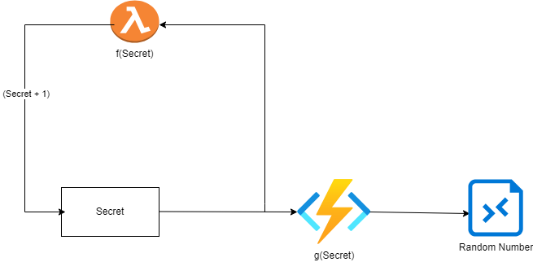
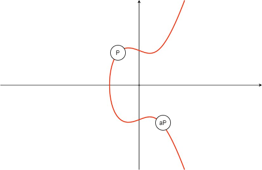
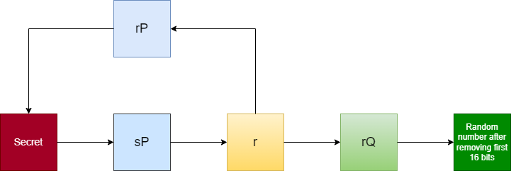

According to Google, *“Elliptic Curve Cryptography (ECC) is a key-based technique for encrypting data. ECC focuses on pairs of public and private keys for decryption and encryption of web traffic.”*

In this post, we’ll break down what that really means—and why understanding randomness is crucial to the security of ECC-based systems.


## Random Number Generators (RNGs)



Random Number Generators (RNGs) form the backbone of cryptographic systems. They rely on an internal state, known as the **secret**, which is initialized using real-world entropy such as keyboard input or hard disk latency. This secret is then processed through a one-way function—typically a hash function—to produce a random number.

To generate subsequent random values, the secret undergoes transformation, updating the internal state. This ongoing process ensures a continuous stream of unpredictable numbers essential for cryptographic operations.

It is vital that these functions use cryptographically secure hash functions to prevent attackers from inferring the secret state. If the internal state is ever compromised, predicting all future random outputs becomes possible.

In the early 2000s, the National Institute of Standards and Technology (NIST) introduced four new RNG algorithms. One of them, **Dual Elliptic Curve Deterministic Random Bit Generator (Dual EC DRBG)**, was based on elliptic curve cryptography. This particular RNG drew attention due to its unconventional design.

## Theory of the Elliptic Curve Backdoor

The theoretical backdoor in elliptic curve-based RNGs functions similarly to the hash-based method described earlier. On an elliptic curve, a base point `P` can be used to generate multiples like `aP`.



However, determining the scalar `a` from a known point `aP` is computationally infeasible due to the **elliptic curve discrete logarithm problem**.



Now, consider two points on the curve, `P` and `Q`, and a secret state used by the RNG. The curve is traversed `s` times using this secret, producing the point `sP`. By taking the x-coordinate of `sP`, we get an intermediate value `r`. The RNG then computes `rQ`, discards the first 16 bits, and returns the remaining bits as the final random number. This intermediate value `r` is also used to update the RNG state by computing `rP`.

For an attacker, even if they know the final random output and can guess the first 16 bits (which would require at most 2¹⁶ = 65,536 attempts), reversing `rQ` to recover `r` is infeasible—**if** `P` and `Q` are truly random and unrelated.

But what if they aren't?

## What If There's a Relationship Between P and Q?

Suppose a hidden relationship exists between `P` and `Q`, such as:

```
P = eQ
```

Where `e` is a fixed, secret multiplier. While difficult to detect or prove, it was later revealed that the NSA had chosen these curve parameters—and did not disclose how.

This raises a serious concern: if such a relationship exists, the random number generator can be compromised. Here's how:

```
P = eQ
P = e(rQ)
P = r(eQ)
P = r(P) (since P = eQ)
```

This means the attacker, knowing `e`, could derive the internal RNG state, effectively breaking the generator’s security.

When the NIST standard was first proposed, cryptographers raised concerns—particularly about the efficiency and security implications of discarding just 16 bits of output. Nevertheless, NIST proceeded with standardizing this RNG.

## Revelation and Fallout

In 2007, cryptographers **Dan Shumow** and **Niels Ferguson** presented a talk outlining the potential for a backdoor in Dual EC DRBG. At that time, the algorithm had already been implemented in several libraries.

Their warning was hypothetical, but it struck a nerve—especially when the **Snowden leaks** in 2013 revealed that the NSA had potentially inserted backdoors into cryptographic standards.

This revelation cast suspicion on the Dual EC DRBG, aligning with earlier concerns. It became evident that **NIST had mandated the use of specific `P` and `Q` values**, without allowing implementers to choose their own. This fueled further speculation that a deliberate backdoor may have been embedded.

## Conclusion

This case highlights the complex and often opaque nature of cryptographic standardization. Even in the face of expert criticism and theoretical vulnerabilities, Dual EC DRBG was adopted—raising long-standing concerns about trust, transparency, and the influence of governmental agencies in shaping cryptographic protocols.


## References

1. [Dual_EC_DRBG - Wikipedia](https://en.wikipedia.org/wiki/Dual_EC_DRBG)
2. [On the Possibility of a Back Door in the NIST SP800-90 Dual Ec Prng](https://rump2007.cr.yp.to/15-shumow.pdf)
3. [Understanding Dual EC DRBG - Video Explanation](https://youtu.be/nybVFJVXbww)
4. [Breaking the NIST standard - Research Paper](https://projectbullrun.org/dual-ec/vulnerability.html)
5. [NIST's Response to the Dual EC DRBG Issue](https://www.nist.gov/news-events/news/2013/09/nist-opens-public-comment-period-revised-cryptographic-standard)

:::note
The second link refers to the original presentation by Dan Shumow and Niels Ferguson at the CRYPTO 2007 Rump Session.
:::


